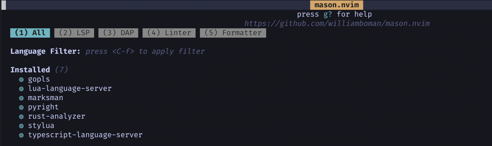

## Setup neovim as IDE 

:white_check_mark: Primarily aimed at devs for quick setup

:white_check_mark: Lazy load of plugins using excellent startup times

:white_check_mark: Lsp management using Mason

:white_check_mark: Excellent tpope plugins

:white_check_mark: Focus on lua based plugins

:white_check_mark: Single file to set everything up

### How to setup

* neovim 0.8.1+
* git 2.3x +
* Nerdfont (not a must)

```
git clone https://github.com/manojkumarmc/lazystart.nvim.git ~/.config/nvim
open nvim from terminal
```

Once nvim is loaded, all plugins will be installed 


All the lsp servers will be installed automatically


